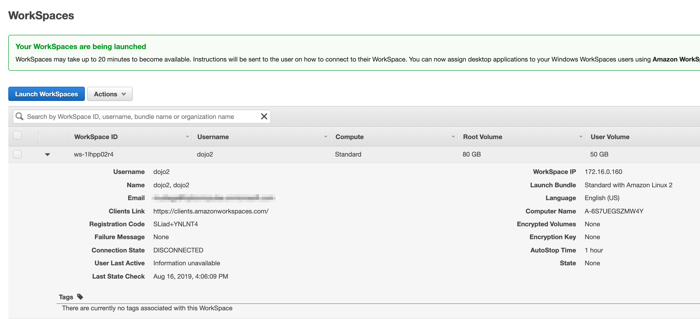

# Creating Your AWS Linux Workspace

## Requirements
* Google Chrome

## Goal - Install these software
* Create an AWS centos workstation

1. Go to [AWS Workspaces](https://console.aws.amazon.com/workspaces/home?region=us-east-1#listworkspaces)

2. Click on **Launch Workspaces**.

3. Use the default Directory.  Click **Next Step**.

4. **Create a user**. Specify username, first name, last name and email then **Create User**.  The user will automatically be added to the workspace in the list at the bottom.  Click **Next Step** to continue.

 
5. Select bundle **Standard with Amazon Linux 2** and click **Next Step**.

6. Under **Workspaces Configuration**, use the defaults and click **Next Step**.

7. Under **Review & Launch WorkSpaces**, use the defaults and click **Launch Workspaces**.

It can take up to 10 minutes for your workspace to be provisioned.

# Connect Your AWS Linux Workspace

1. Go to [AWS Workspaces](https://console.aws.amazon.com/workspaces/home?region=us-east-1#listworkspaces).

2. Expand the details below your workspace where you will find the the clients link and your registration code.  

3.  Preferably using Chrome, Go to [Workspace Clients](https://clients.amazonworkspaces.com) and click Launch the client based on your type of desktop.  That will download the desktop client for you to install and launch.  The preference is to use the desktop client but in the case of blocked ports use the Web Client. To use the web client click on **Web Access** which will will open up a new [Client Browser Tab](https://clients.amazonworkspaces.com/webclient#/registration).

5. Enter your registration code.

6. Then enter the username and password created in the previous section to login to the workstation.  .

7. Upon successful login you will see the desktop. 

8. In the case that you get a timeout, start the login process again.

