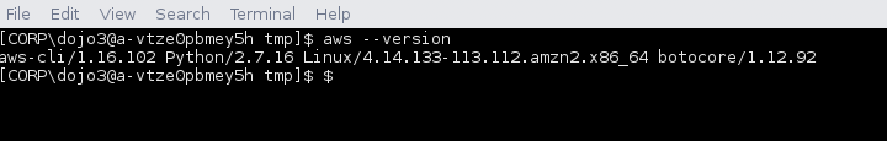
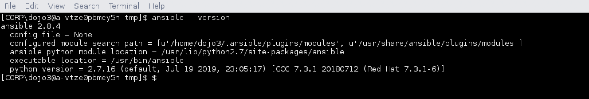

# Setup Tools In AWS Linux Workspace


## Tasks - Install these software
* AWS CLI Client 
* Ansible 2.8
* Vagrant
* Terraform
* Git repo
* Atom editor + packages
* Install workstation key file.
* Configure AWS Credentials 

Open up a terminal window using the icon at the bottom of the screen.

1) Change to the /tmp folder.  All the contents are stored here. 

```
cd /tmp
```

2)  Install the Python Package Manager [pip](https://www.pypa.io/en/latest/). 

```
curl https://bootstrap.pypa.io/get-pip.py -o get-pip.py
sudo python get-pip.py
```

3)  Install [AWS Client](https://clients.amazonworkspaces.com/). 

```
sudo pip install awscli
aws --version
```



4)  Install [Ansible](https://docs.ansible.com/). 

```
# install ansible
sudo pip install ansible

# check version
ansible --version
```


5) Install Vagrant
These commands installs & verifies Vagrant 2.2.5.

```
wget https://releases.hashicorp.com/vagrant/2.2.5/vagrant_2.2.5_x86_64.rpm
sudo rpm -i vagrant_2.2.5_x86_64.rpm 
vagrant version
vagrant plugin install vagrant-aws
vagrant box add dummy https://github.com/mitchellh/vagrant-aws/raw/master/dummy.box
```

6) Install Terraform
These commands installs & verifies Terraform.

```
cd /tmp 
wget https://releases.hashicorp.com/terraform/0.11.7/terraform_0.11.7_linux_amd64.zip
unzip terraform_0.11.7_linux_amd64.zip 
sudo mv terraform /usr/local/bin 
sudo chmod +x /usr/local/bin/terraform 
terraform version
```

7) Clone git repo

```
cd /tmp							
git clone https://github.com/hpedevops/perspecta-dojo.git
username: dojo-guest1
password: DevSecOpsDojo101!
```									

8) Atom install

```
sudo rpm --import https://packagecloud.io/AtomEditor/atom/gpgkey
sudo cp /tmp/perspecta-dojo/tools/workspace/vscode.repo /etc/yum.repos.d/vscode.repo
sudo yum install -y atom

#sudo vi /etc/yum.repos.d/vscode.repo
#[Atom]
#name=Atom Editor
#baseurl=https://packagecloud.io/AtomEditor/atom/el/7/$basearch
#enabled=1
#gpgcheck=0
#repo_gpgcheck=1
#gpgkey=https://packagecloud.io/AtomEditor/atom/gpgkey
```


9) Install atom packages

Launch atom 
```
atom
```
Install these packages
*  atom-cform
*  language-terraform


10) Copy pem file into .ssh 

This key file is used to create the five workstations & logon to them.

```
   mkdir ~/.ssh/
   cp /tmp/perspecta-dojo/tools/vagrant/demo/demo-workstation.* ~/.ssh
```


# Configure AWS Credentials

Open up a terminal window using the icon at the bottom of the screen.

1) Execute `aws configure` and enter your aws CLI credentials.

| prompt | value |
|----|---|
| access-key-id	|   created earlier |
| secret-key-id	|  created earlier |
| region	| **us-east-2**|
| output-format	|   default |


2) Execute `aws ec2 describe-instances` to confirm you can connect to AWS.
